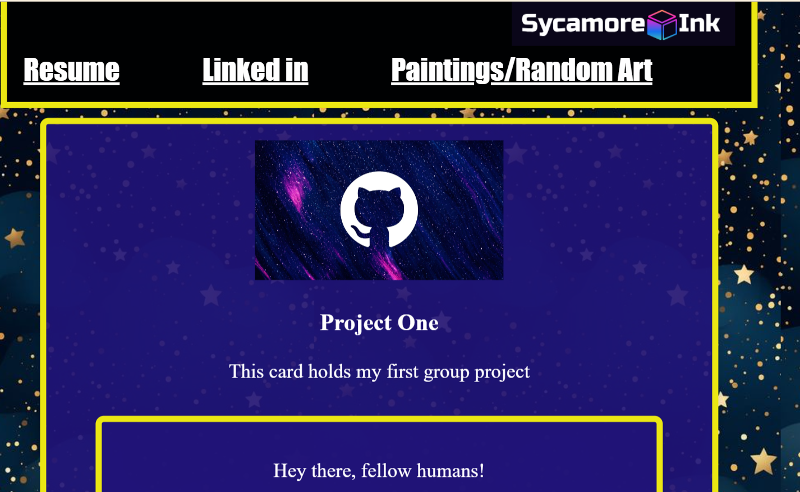

# Challenger2ReSubmit
Challenge 2 Redo: Demonstrating Improvement Through Knowledge Growth

## Project Objective
To showcase personal growth and improvement by remaking Challenge 2 with enhanced knowledge and skills.

## Project Overview:

1. Introduction
- Briefly explain the motivation behind redoing Challenge 2.
- Describe the goal of the project: to demonstrate improvement through the application of newly acquired knowledge.
2. Initial Assessment
- Reflect on the original Challenge 2 submission.
- Identify areas where knowledge was lacking or skills were underdeveloped.
3. Knowledge Acquisition
- Outline the steps taken to address the identified gaps.
- Describe the resources used for learning and skill development (e.g., courses, tutorials, practical exercises).
4. Project Redo
- Detail the process of remaking Challenge 2.
- Highlight the improvements made in comparison to the original submission.
- Include screenshots, code snippets, or other relevant materials to illustrate the changes.
5. Results and Evaluation
- Present the outcomes of the redo project.
- Compare the new submission to the original in terms of quality, functionality, and adherence to best practices.
- Discuss any challenges encountered during the redo process and how they were overcome.
6. Reflection and Learning Outcomes
- Reflect on the journey from the original Challenge 2 to the redo project.
- Analyze the impact of knowledge growth and skill development on the quality of work.
- Identify key lessons learned and insights gained through the experience.
7. Conclusion
- Summarize the key findings and takeaways from the project.
- Emphasize the importance of continuous learning and improvement in personal and professional development.
- Future Directions
- Outline potential areas for further growth and development.
- Discuss future projects or challenges where newly acquired knowledge and skills can be applied.

## Resources Used
- mdn web docs https://developer.mozilla.org/en-US/docs/Web/CSS
- stack overflow https://developer.mozilla.org/en-US/docs/Web/CSS
- used old repo code :https://github.com/Mistaken40033/new_adventure.git ()
- modifying to new look : https://github.com/Mistaken40033/Challenger2ReSubmit.git  ()
- Xpert Learning

## License
MIT License